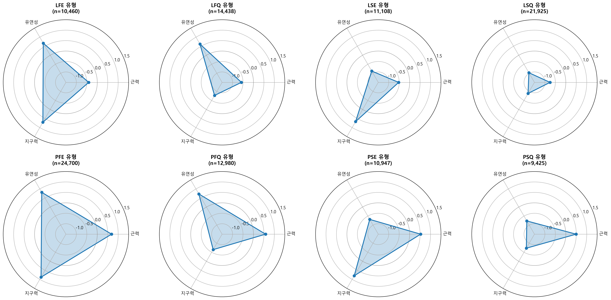
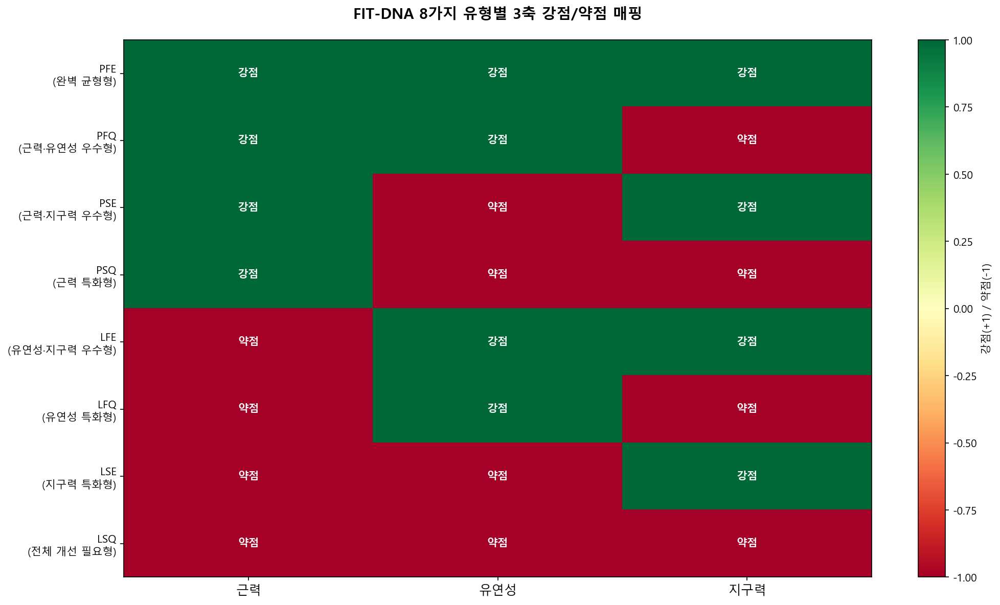
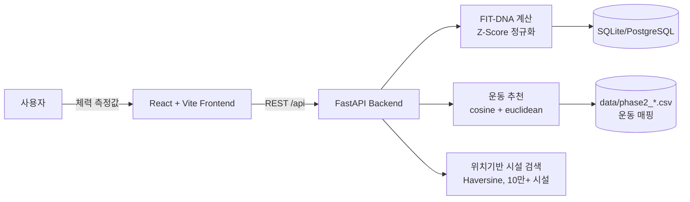

# FIT-DNA — 체력 MBTI 플랫폼

> 체력 측정 데이터로 **나의 체력 유형(8가지 FIT-DNA)** 을 알아보고, 그에 맞는 운동·시설을 추천받는 플랫폼.
> "내가 어떤 운동을 해야 하는지 알기 어렵다"는 흔한 고민을 데이터로 풀어보려고 만들었습니다.

[](LICENSE)




---

## 🎯 핵심 아이디어

3가지 축으로 체력을 분해 → 각 축의 강·약으로 **2³ = 8가지 타입** 분류:

| 축 | 강 | 약 |
| --- | --- | --- |
| 근력 | **P**ower | **L**ight |
| 유연성 | **F**lexible | **S**tiff |
| 지구력 | **E**ndurance | **Q**uick |

예: `PFE` = 근력↑·유연성↑·지구력↑ (만능형) / `LSQ` = 근력↓·유연성↓·지구력↓ (전반 강화 필요).

이 분류 위에 두 단계를 얹었습니다.

- **Phase 1 — 분류 모델**: 공공데이터포털의 10만 건 체력측정 데이터를 Z-Score 로 연령·성별 정규화 → 8 타입 분포 산출
- **Phase 2 — 추천 알고리즘**: 타입별 강·약점에 맞춘 운동 매칭 (코사인 유사도 + 유클리드 거리)



---

## 🧱 아키텍처



- **Backend**: FastAPI + SQLAlchemy + Pandas/NumPy/scikit-learn
- **Frontend**: React 18 + TypeScript + Vite + Tailwind v4 + shadcn/ui (Figma Make 출신)
- **Data**: 공공데이터포털 [KS_NFA_FTNESS](https://www.data.go.kr/data/15094847/fileData.do) + 자체 가공한 운동 카탈로그

---

## 📁 레포 구조

```
.
├── analysis/                # 데이터 분석 결과 시각화 (phase1/phase2 PNG)
├── data/                    # 가공 데이터 (FIT-DNA reference, 운동 매핑, 매칭 매트릭스)
│   ├── exercise_recommendations/   # 8 타입별 운동 추천 CSV
│   └── mock/                # 데모용 mock 데이터
├── docs/                    # 기획·핸드오버·배포 가이드 문서
├── scripts/                 # 데이터 가공·테이블 생성·예시 스크립트
├── backend/                 # FastAPI 서버
│   ├── app/                 # routers, models, services, core/config
│   ├── parse_facilities.py  # 시설 데이터 ETL
│   ├── seed_data.py         # 초기 데이터 시드
│   ├── render.yaml          # Render.com 배포 설정
│   └── requirements.txt
└── Web/                     # React + Vite 프론트엔드
    ├── components/          # 화면 컴포넌트 + shadcn/ui 48종
    ├── services/api.ts      # FastAPI 클라이언트
    ├── src/main.tsx         # 엔트리
    └── package.json
```

raw 측정 데이터(`KS_NFA_FTNESS_*.csv`, `fit_dna_preprocessed_cp949.csv`)는 .gitignore 처리됨 — 출처 링크에서 직접 받으시면 됩니다.

---

## 🚀 빠른 시작

### Backend

```bash
cd backend
python -m venv venv && source venv/bin/activate   # Windows: venv\Scripts\activate
pip install -r requirements.txt

cp .env.example .env
# .env 의 SECRET_KEY 채우기 — 예: openssl rand -hex 32

python seed_data.py    # 시설·운동 시드
python run.py          # http://localhost:8001/api/docs (Swagger)
```

> ⚠️ `SECRET_KEY` 가 비어있으면 startup 에서 `RuntimeError` 가 나도록 가드를 넣어뒀습니다. 잊지 마세요.

### Frontend

```bash
cd Web
npm install
npm run dev            # http://localhost:5173 (Vite proxy 로 /api → localhost:8001)
```

API 가 안 떠 있어도 화면은 뜨고, mock 데이터로 흐름을 확인할 수 있습니다.

---

## 🧪 주요 API

| Method | Path | 설명 |
| --- | --- | --- |
| GET | `/api/fitdna/result/{user_id}` | 저장된 FIT-DNA 결과 조회 |
| POST | `/api/fitdna/calculate` | 측정값으로 FIT-DNA 계산 |
| GET | `/api/reports/monthly/{user_id}` | 월간 리포트 |
| GET | `/api/reports/fitdna-history/{user_id}` | 변화 추이 |
| GET | `/api/facilities/nearby?lat=..&lon=..&radius=..` | 주변 시설 검색 (10만+) |
| GET | `/api/daily/check/{user_id}` / POST `/api/daily/check` | 하루 건강 체크 |

---

## 📊 데이터·분석 한눈에

| 화면 | 자료 |
| --- | --- |
| 8 타입 분포 | [`analysis/phase1_fitdna_type_distribution.png`](analysis/phase1_fitdna_type_distribution.png) |
| 인구통계학적 분석 | [`analysis/phase1_demographic_analysis.png`](analysis/phase1_demographic_analysis.png) |
| 성별·연령 상세 | [`analysis/phase1_gender_age_fitdna_detail.png`](analysis/phase1_gender_age_fitdna_detail.png) |
| 추천 운동 분포 | [`analysis/phase2_exercise_recommendation_distribution.png`](analysis/phase2_exercise_recommendation_distribution.png) |
| 매칭 알고리즘 분석 | [`analysis/phase2_matching_algorithm_analysis.png`](analysis/phase2_matching_algorithm_analysis.png) |

기획·핸드오버·DB 스키마 등은 [`docs/`](docs/) 참고 — `BACKEND_STRUCTURE.md`, `DATABASE_SCHEMA.md`, `HANDOVER_FIT-DNA계산모듈.md`, `HANDOVER_운동매칭알고리즘.md`, `DEPLOYMENT.md` 등.

---

## 🛠 기술 결정 메모

- **왜 Z-Score 였나** — 단순 절대값으로 비교하면 20대 남성과 60대 여성을 같은 기준으로 평가하게 됨. Z-Score 정규화는 연령·성별 분포 안에서 "내가 어디쯤" 인지를 비교 가능한 단위로 만들어줍니다.
- **왜 8 타입 (2³)** — 4×4 매트릭스(16칸)는 사용자가 기억하기 어렵고, 2 타입은 너무 거칠다. 3 축 8 타입은 MBTI 류와 친숙한 구조라 진단 결과로 받아들이기 쉬움.
- **왜 코사인+유클리드 동시 사용** — 운동 카탈로그가 sparse 해서 코사인만 쓰면 "전체적으로 비슷한 운동"으로 쏠리는 경향. 유클리드 거리로 절대 강도 차이도 함께 반영.
- **시설 검색에 Haversine** — 사용자 위치 기준 반경 검색은 PostGIS 없이도 충분히 동작하고, 10만 건은 인메모리 인덱스로 응답 가능.

---

## 👤 My Role — 서현우 (westhnu)

본 레포는 팀 프로젝트의 결과물이며, 제가 담당한 영역은 다음과 같습니다.

- **FIT-DNA 계산 모듈 설계·구현** (`backend/app/services/`, `scripts/fitdna_from_measurements.py`) — Z-Score 정규화, 8 타입 분류 로직
- **운동 추천 알고리즘** (`scripts/HaruAdvice.py`, `scripts/models_monthly_report.py`) — 코사인+유클리드 하이브리드 매칭, 월간 리포트 생성
- **데이터 파이프라인** — 공공데이터 raw → 정제 → 추천 매트릭스 생성 (`scripts/generate_*.py`)
- **백엔드 API 통합** — FastAPI 라우터 설계, 시설 검색 Haversine 구현

본 레포에 있는 분석 시각화 (`analysis/phase1_*.png`, `phase2_*.png`) 도 제가 만든 결과물입니다. 자세한 회고는 [`docs/HANDOVER_FIT-DNA계산모듈.md`](docs/HANDOVER_FIT-DNA계산모듈.md), [`docs/HANDOVER_운동매칭알고리즘.md`](docs/HANDOVER_운동매칭알고리즘.md).

---

## 라이선스

코드: [MIT](LICENSE). raw 측정 데이터는 [공공데이터포털 KS_NFA_FTNESS](https://www.data.go.kr/data/15094847/fileData.do) 라이선스를 따릅니다.

---

**Built by 하누 / Hanu ([@westhnu](https://github.com/westhnu))** — AI 콘텐츠 크리에이터 · 인공지능학과 4학년
